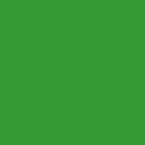
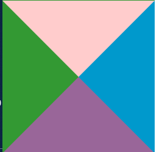
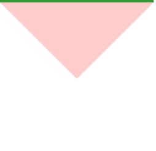

## 前言
写网页经常会用到三角形符号，通常使用图片最简单，但是缩放有时不是很好，很容易失真。CSS便写的话就没有这些限制了。
<!-- more -->

## 步骤
先来看一段代码
``` css
/**css*/
.d1{
    width: 0; 
    height: 0; 
    border: 100px solid #339933;
}
/**html*/
<div class="d1"></div>
```


换成不同的颜色

```
/**css*/
.d2{
    width: 0; 
    height: 0;
    border-width: 100px;
    border-style: solid;
    border-color:#FFCCCC #0099CC #996699 #339933;
}
/**html*/
<div class="d2"></div>
```


将其他三个方向改为透明

```
/**css*/
.d2{
    width: 0; 
    height: 0;
    border-width: 100px;
    border-style: solid;
    border-color:#FFCCCC transparent transparent transparent;
}
/**html*/
<div class="d2"></div>
```


大功告成！！

## 画箭头
``` css
.left {
    position: absolute;
}

.left:before,
.left:after {
    position: absolute;
    content: '';
    border-top: 10px transparent dashed;
    border-left: 10px transparent dashed;
    border-bottom: 10px transparent dashed;
    border-right: 10px #fff solid;
}

.left:before {
    border-right: 10px #0099CC solid;
}

.left:after {
    left: 1px;
    /*覆盖并错开1px*/
    border-right: 10px #fff solid;
}
<i class="left"></div>
```


