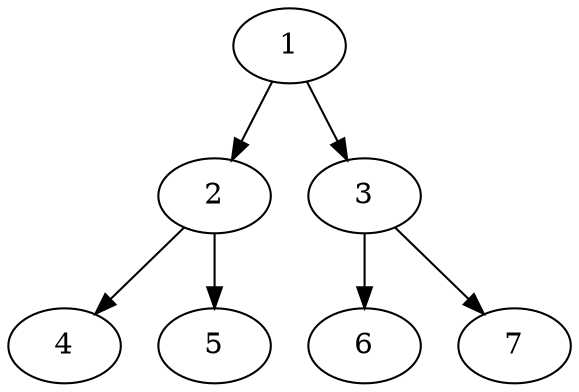

``` dot
digraph 二叉树 {
    1 -> 2;
    1 -> 3;
    2 -> 4;
    2 -> 5;
    3 -> 6;
    3 -> 7;
}
```

完全二叉树有`n`个节点，对于节点`m`来说:

- `m!=1` 则 `m`父节点为$$\lfloor m/2\rfloor$$

vscode 安装`Markdown Preview Enhanced`可显示二叉图
