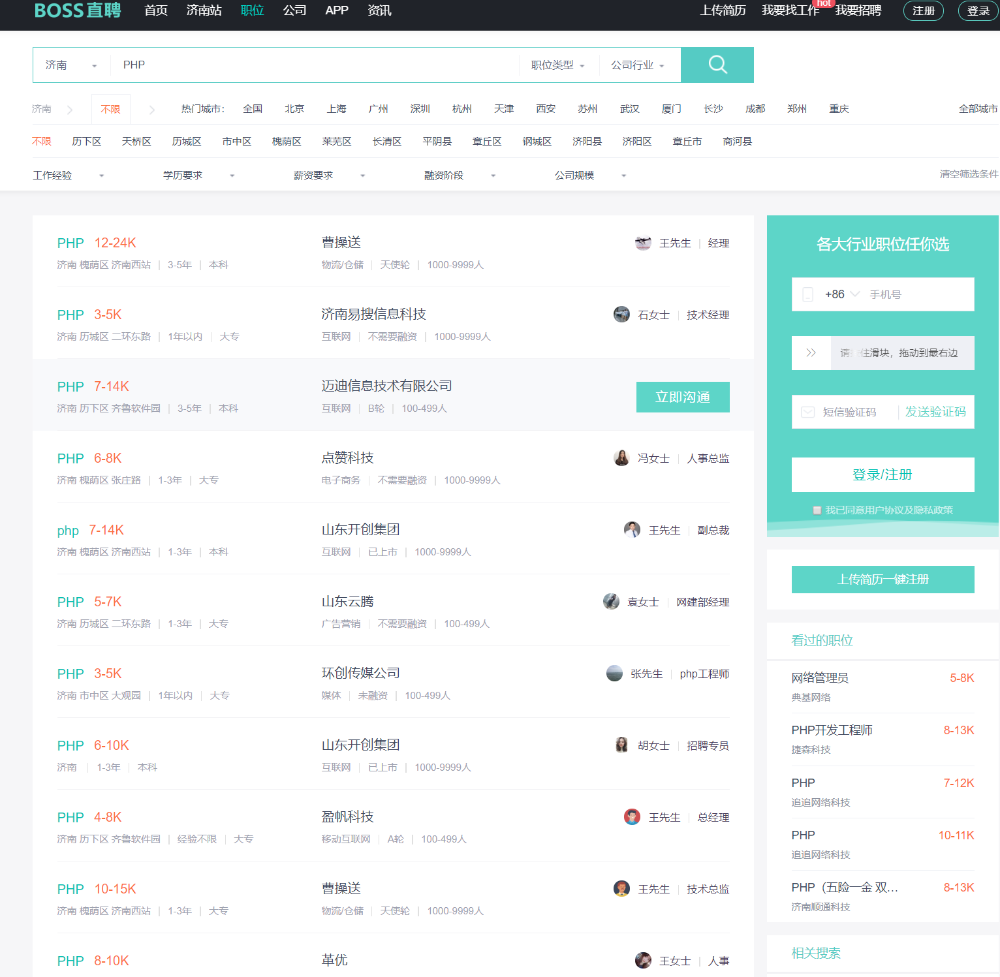

## 环境准备

1. Python 3.7
1. Mysql
1. requests
1. PyMySQL
1. BeautifulSoup

## 获取数据
<!-- more -->
### 分析数据请求过程

1. 首先我们打开boss直聘网查看正常的请求过程



2. 打开万能的 F12，刷新，查看下当前网络发生了什么

<br />通过上图能够看到请求参数中包含了职位，页数等信息。
<a name="dUIJR"></a>
### 构造模拟请求


```python
import requests
url = "https://www.zhipin.com/c101120100/?query=" + kw+"&page="+str(page)+"&ka=page-"+str(page)
headers = {
    'Host': 'www.zhipin.com',
    'User-Agent': 'Mozilla/5.0 (Windows NT 10.0; Win64; x64; rv:72.0) Gecko/20100101 Firefox/72.0',
    'Accept': 'text/html,application/xhtml+xml,application/xml;q=0.9,image/webp,*/*;q=0.8',
    'Accept-Language': 'zh-CN,zh;q=0.8,zh-TW;q=0.7,zh-HK;q=0.5,en-US;q=0.3,en;q=0.2',
    'Accept-Encoding': 'gzip, deflate, br',
    'Referer': 'https://www.zhipin.com/job_detail/?city=101120100&source=10&query=PHP',
    'DNT': '1',
    'Connection': 'keep-alive',
    'Cookie': '__c=1579400100; __g=-; __l=l=https%3A%2F%2Fwww.zhipin.com%2Fweb%2Fcommon%2Fsecurity-check.html%3Fseed%3DEWjlLZs%252FPr8cqa5Hs%252FGzdK13lMxlscxjvlJZWtdzaQs%253D%26name%3D986ad753%26ts%3D1579400102260%26callbackUrl%3D%252Fjob_detail%252F%253Fcity%253D101120100%2526source%253D10%2526query%253DPHP%26srcReferer%3D&r=&friend_source=0&friend_source=0; __a=83048337.1579400100..1579400100.11.1.11.11; __zp_stoken__=f0d1JSxtXmdA15ixnd1Lh9vbs1Yr2dghco%2FMt7MWfOXsroaplWan5qqBsdTxTRJMadp2RpuuULVCxSdPrFHXeLlCNNw5OdJC3nz6lIaV0p2mXbKx6jgrj3tQ4%2B4zcEDE2SBk',
    'Upgrade-Insecure-Requests': '1',
    'Cache-Control': 'max-age=0',
    'TE': 'Trailers'
}
r = requests.get(url, headers=headers)
```
所有请求头原封不动拷下来，放入 `headers` 。 `cookie` 需要拷贝自己浏览器的内容，单独使用上面的会失效。
<a name="uJ6KA"></a>
### 分析网页结构
解析出需要的信息。这一步我们用到了 `BeautifulSoup` 。<br /><br />分析发现所有的职位都有类  `job-primary`

```python
soup = BeautifulSoup(r.text, "lxml")
all_jobs = soup.select("div .job-primary")
```
继续分析<br /><br />自此，基本信息获取完毕，下一步组装信息。
<a name="EbjrU"></a>
### 组装信息

```python
for job in all_jobs:
    jname = job.find("div", attrs={"class": "job-title"}).text
    jurl = "https://www.zhipin.com" + \
    job.find("div", attrs={"class": "info-primary"}).h3.a.attrs['href']
    jid = job.find(
        "div", attrs={"class": "info-primary"}).h3.a.attrs['data-jid']
    sal = job.find("div", attrs={"class": "info-primary"}).h3.a.span.text
    info_contents = job.find(
        "div", attrs={"class": "info-primary"}).p.contents
    addr = info_contents[0]

    if len(info_contents) == 3:
        work_year = "无数据"
        edu = job.find(
            "div", attrs={"class": "info-primary"}).p.contents[2]
    elif len(info_contents) == 5:
        work_year = job.find(
            "div", attrs={"class": "info-primary"}).p.contents[2]
        edu = job.find(
            "div", attrs={"class": "info-primary"}).p.contents[4]
    elif len(info_contents) == 7:
        work_year = job.find(
            "div", attrs={"class": "info-primary"}).p.contents[-3]
        edu = job.find(
            "div", attrs={"class": "info-primary"}).p.contents[-1]
        company = job.find("div", attrs={"class": "company-text"}).h3.a.text
        company_type = job.find(
            "div", attrs={"class": "company-text"}).p.contents[0]
        company_staff = job.find(
            "div", attrs={"class": "company-text"}).p.contents[-1]
    print(jid, jname, jurl, sal, addr, work_year,
              edu, company, company_type, company_staff)
    infos.append({
        "jid": jid,
        "name": jname,
        "sal": sal,
        "addr": addr,
        "work_year": work_year,
        "edu": edu,
        "company": company,
        "company_type": company_type,
        "company_staff": company_staff,
        "url": jurl})
print("%s职位信息，第%d页抓取完成" % (kw, page))
# print(infos)
```
<a name="hjiW7"></a>
### 完整代码

```python
def get_one_page_info(kw, page):
    url = "https://www.zhipin.com/c101120100/?query=" + \
        kw+"&page="+str(page)+"&ka=page-"+str(page)
    headers = {
        'Host': 'www.zhipin.com',
        'User-Agent': 'Mozilla/5.0 (Windows NT 10.0; Win64; x64; rv:72.0) Gecko/20100101 Firefox/72.0',
        'Accept': 'text/html,application/xhtml+xml,application/xml;q=0.9,image/webp,*/*;q=0.8',
        'Accept-Language': 'zh-CN,zh;q=0.8,zh-TW;q=0.7,zh-HK;q=0.5,en-US;q=0.3,en;q=0.2',
        'Accept-Encoding': 'gzip, deflate, br',
        'Referer': 'https://www.zhipin.com/job_detail/?city=101120100&source=10&query=PHP',
        'DNT': '1',
        'Connection': 'keep-alive',
        'Cookie': '__c=1579400100; __g=-; __l=l=https%3A%2F%2Fwww.zhipin.com%2Fweb%2Fcommon%2Fsecurity-check.html%3Fseed%3DEWjlLZs%252FPr8cqa5Hs%252FGzdK13lMxlscxjvlJZWtdzaQs%253D%26name%3D986ad753%26ts%3D1579400102260%26callbackUrl%3D%252Fjob_detail%252F%253Fcity%253D101120100%2526source%253D10%2526query%253DPHP%26srcReferer%3D&r=&friend_source=0&friend_source=0; __a=83048337.1579400100..1579400100.11.1.11.11; __zp_stoken__=f0d1JSxtXmdA15ixnd1Lh9vbs1Yr2dghco%2FMt7MWfOXsroaplWan5qqBsdTxTRJMadp2RpuuULVCxSdPrFHXeLlCNNw5OdJC3nz6lIaV0p2mXbKx6jgrj3tQ4%2B4zcEDE2SBk',
        'Upgrade-Insecure-Requests': '1',
        'Cache-Control': 'max-age=0',
        'TE': 'Trailers'
    }
    r = requests.get(url, headers=headers)
    soup = BeautifulSoup(r.text, "lxml")
    # print(soup)
    # 先获取每一行的列表数据
    all_jobs = soup.select("div.job-primary")
    infos = []
    for job in all_jobs:
        jname = job.find("div", attrs={"class": "job-title"}).text
        jurl = "https://www.zhipin.com" + \
            job.find("div", attrs={"class": "info-primary"}).h3.a.attrs['href']
        jid = job.find(
            "div", attrs={"class": "info-primary"}).h3.a.attrs['data-jid']
        sal = job.find("div", attrs={"class": "info-primary"}).h3.a.span.text
        info_contents = job.find(
            "div", attrs={"class": "info-primary"}).p.contents
        addr = info_contents[0]
       
        if len(info_contents) == 3:
            work_year = "无数据"
            edu = job.find(
                "div", attrs={"class": "info-primary"}).p.contents[2]
        elif len(info_contents) == 5:
            work_year = job.find(
                "div", attrs={"class": "info-primary"}).p.contents[2]
            edu = job.find(
                "div", attrs={"class": "info-primary"}).p.contents[4]
        elif len(info_contents) == 7:
            work_year = job.find(
                "div", attrs={"class": "info-primary"}).p.contents[-3]
            edu = job.find(
                "div", attrs={"class": "info-primary"}).p.contents[-1]
        company = job.find("div", attrs={"class": "company-text"}).h3.a.text
        company_type = job.find(
            "div", attrs={"class": "company-text"}).p.contents[0]
        company_staff = job.find(
            "div", attrs={"class": "company-text"}).p.contents[-1]
        print(jid, jname, jurl, sal, addr, work_year,
              edu, company, company_type, company_staff)
        infos.append({
            "jid": jid,
            "name": jname,
            "sal": sal,
            "addr": addr,
            "work_year": work_year,
            "edu": edu,
            "company": company,
            "company_type": company_type,
            "company_staff": company_staff,
            "url": jurl})
    print("%s职位信息，第%d页抓取完成" % (kw, page))
    # print(infos)
    return infos
```

<a name="s1QmT"></a>
## 保存数据
<a name="ll6yB"></a>
### 创建数据库
简单创建个数据表

```sql
DROP TABLE IF EXISTS `boss_job`;
CREATE TABLE `boss_job`  (
  `jid` varchar(255) CHARACTER SET utf8mb4 COLLATE utf8mb4_general_ci NOT NULL,
  `name` varchar(255) CHARACTER SET utf8mb4 COLLATE utf8mb4_general_ci NULL DEFAULT NULL,
  `sal` varchar(255) CHARACTER SET utf8mb4 COLLATE utf8mb4_general_ci NULL DEFAULT NULL,
  `addr` varchar(255) CHARACTER SET utf8mb4 COLLATE utf8mb4_general_ci NULL DEFAULT NULL,
  `work_year` varchar(255) CHARACTER SET utf8mb4 COLLATE utf8mb4_general_ci NULL DEFAULT NULL,
  `edu` varchar(255) CHARACTER SET utf8mb4 COLLATE utf8mb4_general_ci NULL DEFAULT NULL,
  `company` varchar(255) CHARACTER SET utf8mb4 COLLATE utf8mb4_general_ci NULL DEFAULT NULL,
  `company_type` varchar(255) CHARACTER SET utf8mb4 COLLATE utf8mb4_general_ci NULL DEFAULT NULL,
  `company_staff` varchar(255) CHARACTER SET utf8mb4 COLLATE utf8mb4_general_ci NULL DEFAULT NULL,
  `url` varchar(255) CHARACTER SET utf8mb4 COLLATE utf8mb4_general_ci NULL DEFAULT NULL,
  PRIMARY KEY (`jid`) USING BTREE
) ENGINE = InnoDB CHARACTER SET = utf8mb4 COLLATE = utf8mb4_general_ci ROW_FORMAT = Dynamic;

```
<a name="g6qLG"></a>
### 保存到数据库
```python
def save_mysql(infos):
    '''保存每一页的数据到数据库中'''
    db = pymysql.connect("localhost", "root",
                         "root", "boss", charset="utf8")
    cursor = db.cursor()
    for job in infos:
        sql = "insert into boss_job values('%(jid)s','%(name)s','%(sal)s','%(addr)s','%(work_year)s'\
        ,'%(edu)s','%(company)s','%(company_type)s','%(company_staff)s','%(url)s');" % (job)
        try:
            cursor.execute(sql)
        except pymysql.Error as e:
            print("数据库出错", e)
            db.rollback()
        else:
            db.commit()
```
<a name="oxIQz"></a>
## 主程序

```python
for i in range(1, 11):
    infos = get_one_page_info("java", i)
    save_mysql(infos)

```

自此，整个爬虫编写完毕，当然还有改进的余地，比如多线程，cookie的自动的获取等等。数据也可以保存到excel文件便于更好的分析。
