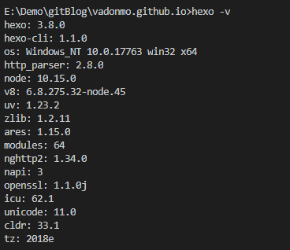
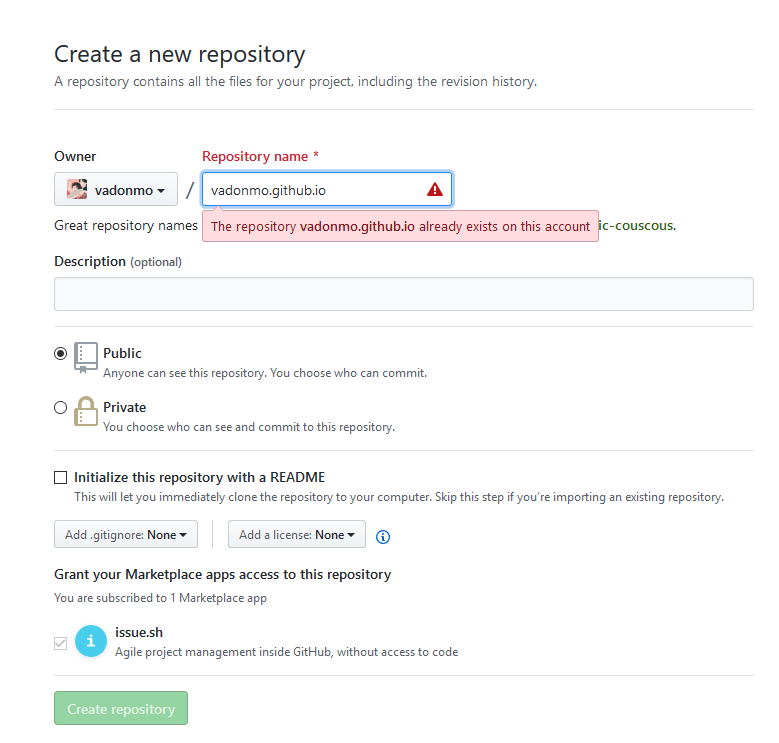
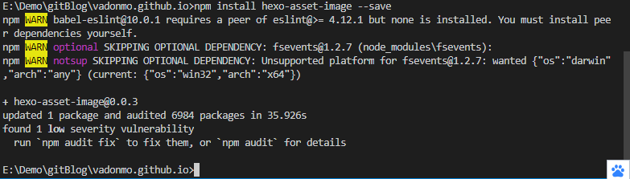
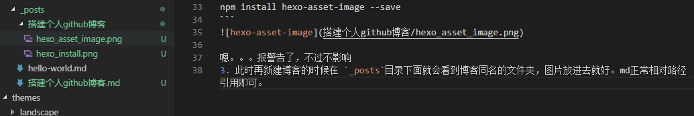

## 前言
说起来有点惭愧，早在16年就搭建了博客，却一直没有写，断断续续在csdn写过一点，都没有长久。本来就不是一个有毅力的人，鬼知道这个博客能写多久。闲话少说，下面记录下搭建过程。
<!--more-->
## 环境准备
### nodejs安装
个人电脑已安装过，本文不再赘述。
### git安装
git人手必备吧，教程自行搜索。
### hexo安装
npm 在安装nodejs后自带，配制环境变量即可任意目录使用。
```
npm install -g hexo-cli
```
验证是否成功
```
hexo -v
```
出现如图所示即为成功



## hexo使用
### 初始化
```
hexo init 
```
一般来说执行一次就够了，没啥特殊的地方。第一次耗时有点久，毕竟gayhub日常被墙，建议dns改为 `8.8.8.8` ,虽传言说这货并非googledns，但架不住好用。改完gayhub网速还是可以的 ~o(*￣▽￣*)o
不想在当前目录初始化，后面可直接跟路径参数，具体用法参考官方文档，此处只记录简单用法。毕竟难点的我也不会。~o(*￣▽￣*)o

### 安装依赖
```
npm install 
```
hexo基于nodejs开发，熟悉node的应该对此命令不陌生。简单说就是安装根目录下面 `package.json` 文件中的各种包。npm毕竟是个包管理工具，类似maven，gradle。

### 生成静态文件
```
hexo g
```

### 启动服务器
```
hexo -s
```
默认端口 `4000` 启动成功后即可在 `localhost:4000` 查看

## 部署至github

### 创建仓库

仓库名格式 `账号.github.io` 一个帐号只允许创建一个仓库，我已经创建了

### 绑定自定义域名
此处非必需。只是因为很久前一时脑抽花50块钱买了个十年的域名，备案的时候才发现，国内不支持。。闲置了好久，正好扔这博客上，反正github不需要备案。


点开新建的仓库，最右侧 `settings`，点开往下拉，如图所示。找到 `Custom domain` 改为自己的域名，保存即可。


### 上传至github
修改根目录 `_config.yml` 中 `deploy` 项即可。
```
deploy:
  type: git
  repository: https://github.com/vadonmo/vadonmo.github.io
  branch: master

```
## 其他问题

### 图片显示问题

 1. 确认根目录 `_config.yml` 中 `post_asset_folder` 值为 `true`，此一步目的在于新建博客时，同时建立同名文件夹，放置相关资源，比如图片，视频等。
 2. 在根目录下执行下列命令
```
npm install hexo-asset-image --save
```


嗯。。。报警告了，不过不影响
3. 此时再新建博客的时候在 `_posts`目录下面就会看到博客同名的文件夹，图片放进去就好。md正常相对路径引用即可。


``` markdown

```

### 换电脑数据没法同步问题
参考知乎大佬解决方案建立分支即可，[传送门](https://www.zhihu.com/question/21193762)
简单来说是将hexo项目上传至博客分支，每次写完 deploy 后将hexo文件一块上传至分支。

### 每次部署CNAME文件消失问题
我的解决办法是在public目录下新建 `CNAME` 文件，里面内容为自己域名。这样每次部署就不会丢失了。

## 结语
就先这样吧，博客写着真累，果然以前不写博客是对的。~o(*￣▽￣*)o
下一篇 讲讲怎么换背景吧，默认的稍微有点难看。
