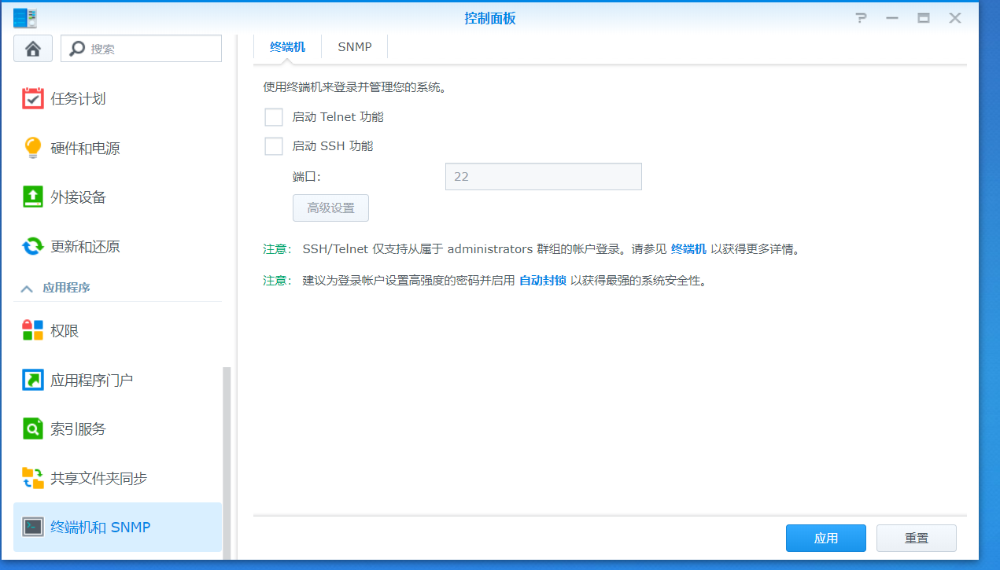
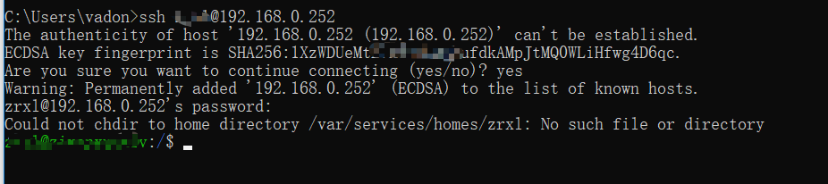
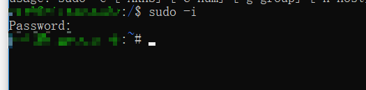

1. 进如群晖后台 - 控制面板 - 终端机和 SNMP - 终端机 - 启用 ssh 功能


<!--more-->
2. ssh登录群晖，具体换成自己的用户名，ip

```
ssh 用户名@IP
```


3. 切换 `root` 权限，密码输入用户名的密码

```
sudo -i
```


4. 打开 `smb.conf` 

```
vim /etc/samba/smb.conf
```

5. 在samba配置文件(/etc/samba/smb.conf)的global section里加入，按 `j` 下移到最后， `i` 切换到插入模式。输入下面两行。
```
map to guest=never
access based share enum=yes
```

6. `esc` 后，输入 `:wq` 保存退出。

7. 重启

```
roboot
```

